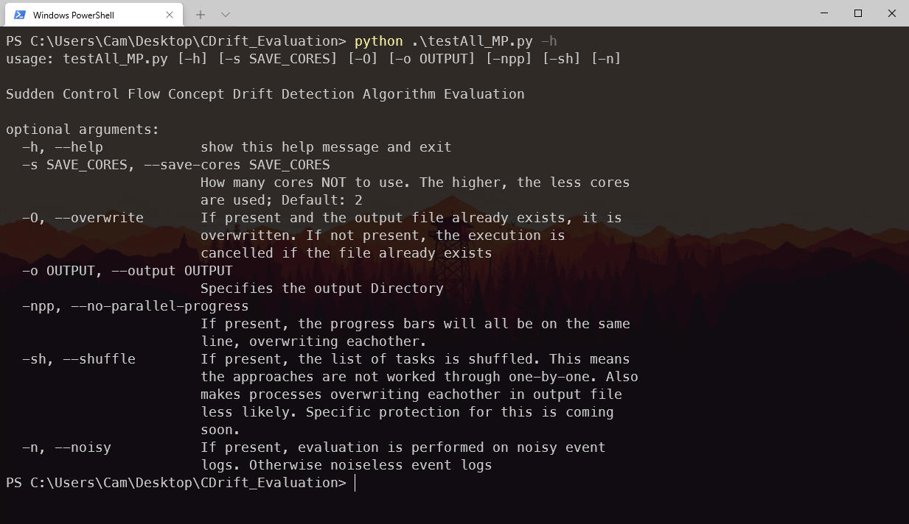

# Concept Drift Evaluation #
- The Evaluation results can be found in the folders `testAll` and `testAll_Noisy` for noiseless and noisy event logs, respectively. The folder structure is as follows:
```
testAll
├───Bose
│   └───npy // saved pvalue sequences
|   *.png // plotted pvalues with detected change points
|   evaluation_results.csv // Evaluation results
├───Earthmover
│   └───npy // saved earth mover's distances
|   *.png // plotted distances with detected change points
|   evaluation_results.csv // Evaluation results
├───Maaradji
│   └───npy // saved pvalue sequences
|   *.png // plotted pvalues with change points
|   evaluation_results.csv // Evaluation results
├───Martjushev
│   └───npy // saved pvalue sequences
|   *.png // plotted pvalues with change points
|   evaluation_results.csv // Evaluation results
├───ProcessGraph
|   evaluation_results.csv // Evaluation results
├───Zheng
|   evaluation_results.csv // Evaluation results
```
- One can explore the algorithms and their parameters in the provided jupyter notebooks `<algorithm-name>_example.ipynb`:
  - [Bose](Examples/bose_example.ipynb)
  - [Martjushev](Examples/martjushev_example.ipynb)
  - [ProDrift](Examples/prodrift_example.ipynb)
  - [Earth Mover's Distance](Examples/earthmover_example.ipynb)
  - [Process Graph Metrics](Examples/process_graph_example.ipynb)
  - [Zheng](Examples/zheng_example.ipynb)
# Usage #
The required packages can be installed using anaconda: 
```bash
> conda env create -f ./environment.yaml
...
> conda activate cdrift-evaluation
```
## Perfoming the Evaluation &mdash; Using testAll_MP.py ##
To use ```testAll_MP.py```, simply run the command ```python testAll_MP.py -h``` to get started. 

The specific explored parameter choices can be changed at the bottom of the ```testAll_MP.py``` file.

</br></br>

## Using the Approaches ##
Event Logs can be found in the ```Sample Logs``` folder, in a noiseless (0% Noise) or noisy (5% Noise) variant. These event logs are from Ostovar et al. Robust Drift Characterization from Event Streams of Business Processes[^fn]

[^fn]: Ostovar et al. Robust Drift Characterization from Event Streams of Business Processes. URL https://doi.org/10.1145/3375398

### Bose et al. ###
- Log-splitting (for Relation Type Count and Relation Entropy) with ```logsplitter.py```
- Extraction functions for J-Measure, Window Count, Relation Type Count, Relation Entropy are in `bose.py`
- Apply the full pipeline with (example for J-Measure + KS Test):
```python
from cdrift.approaches import bose
from pm4py import read_xes
log = read_xes(PATH_TO_LOG) # Import the Log
pvalues = bose.detectChange_JMeasure_KS(log, windowSize, measure_window, activityName_key) # Extract J-Measure, Apply Sliding Window tests with KS-Test
changepoints = bose.visualInspection(log, trim=windowSize) # Visual Inspection
```
### Martjushev et al. ###
- Extraction functions in `bose.py`
- Apply the full pipeline with (example for J-Measure + KS Test):
```python
from cdrift.approaches import martjushev
from pm4py import read_xes
log = read_xes(PATH_TO_LOG) # Import the Log
changepoints, pvalues = martjushev.detectChange_JMeasure_KS(log, windowSize, pvalue, return_pvalues=True, j_measure_window) # Extract J-Measure, apply sliding window with recursive bisection
```
### ProDrift ###
- Apply the full pipeline with:
```python
from cdrift.approaches import maaradji
from pm4py import read_xes
log = read_xes(PATH_TO_LOG) # Import the Log
changepoints, pvalues = maaradji.detectChangepoints(log, windowSize, pvalue, return_pvalues=True)
```
### Earth Mover's Distance ###
- Apply the full pipeline with:
```python
from cdrift.approaches import earthmover
from pm4py import read_xes
log = read_xes(PATH_TO_LOG) # Import the Log
traces = earthmover.extractTraces(log) # Extract Time Series of Traces
em_dists = earthmover.calculateDistSeries(traces, windowSize) # Calculate Earth Mover's Distances
changepoints = earthmover.visualInspection(em_dists,trim=windowSize) # Visual Inspection
```

### Process Graph Metrics ###
- Apply the full pipeline with:
```python
from cdrift.approaches import process_graph_metrics as pgm
from pm4py import read_xes
log = read_xes(PATH_TO_LOG) # Import the Log
changepoints = pgm.detectChange(log, windowSize,maxWinSize, pvalue)
```

### Zheng et al. ###
- Apply the full pipeline with:
```python
from cdrift.approaches import zheng
from pm4py import read_xes
log = read_xes(PATH_TO_LOG) # Import the Log
changepoints = zheng.apply(log,mrid, epsilon)
```
## Evaluation ##
- Evaluation is done performed using `evaluation.py`:
```python
from cdrift import evaluation
f1 = evaluation.F1_Score(lag_window, detected_cps, known_cps)# Calculate F1-Score
# Or:
tp, fp = evaluation.calcTP_FP(lag_window, detected_cps,known_cps) # Calculate True/False Positives
# Or:
from numpy import NaN
precision, recall = evaluation.calcPrecision_Recall(lag_window, detected_cps,known_cps, zero_division=NaN) # Calculate Precision/Recall
```